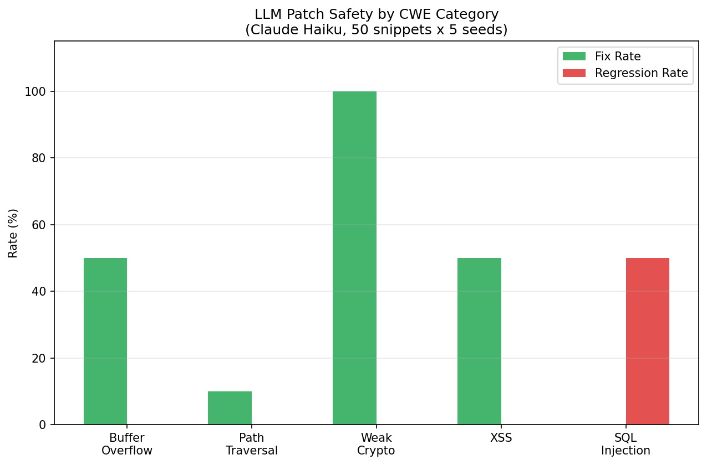

# LLM-Generated Patch Correctness

**LLM security patches have a 42% fix rate and 10% regression rate — but CWE category determines everything. Weak crypto fixes are 100% correct. SQL injection patches are net-negative: 0% fix rate with 50% regression, introducing new injection vectors in half of attempts.**

**Blog post:** [LLM Patches Fix Crypto Bugs Perfectly — But Make SQL Injection Worse](https://rexcoleman.dev/posts/llm-patch-correctness/)

  



## Key Results

| CWE Category | Fix Rate | Regression Rate | Verdict |
|---|---|---|---|
| CWE-327 (Weak Crypto) | **100%** | 0% | Safe to automate |
| CWE-120 (Buffer Overflow) | 50% | 0% | Review required |
| CWE-79 (XSS) | 50% | 0% | Review required |
| CWE-22 (Path Traversal) | 10% | 0% | Rarely fixes |
| CWE-89 (SQL Injection) | **0%** | **50%** | **Net-negative — makes it worse** |

## Quick Start

```bash
git clone https://github.com/rexcoleman/llm-patch-correctness
cd llm-patch-correctness
pip install -e .
bash reproduce.sh
```

## Project Structure

```
FINDINGS.md # Research findings with pre-registered hypotheses and full results
EXPERIMENTAL_DESIGN.md # Pre-registered experimental design and methodology
HYPOTHESIS_REGISTRY.md # Hypothesis predictions, results, and verdicts
reproduce.sh # One-command reproduction of all experiments
governance.yaml # govML governance configuration
LICENSE # MIT License
pyproject.toml # Python project configuration
scripts/ # Experiment and analysis scripts
src/ # Source code
tests/ # Test suite
outputs/ # Experiment outputs and results
data/ # Data files and datasets
docs/ # Documentation and decision records
```

## Methodology

See [FINDINGS.md](FINDINGS.md) and [EXPERIMENTAL_DESIGN.md](EXPERIMENTAL_DESIGN.md) for detailed methodology, pre-registered hypotheses, and full experimental results with multi-seed validation.

## License

[MIT](LICENSE) 2026 Rex Coleman

---

Governed by [govML](https://rexcoleman.dev/posts/govml-methodology/) v3.3
