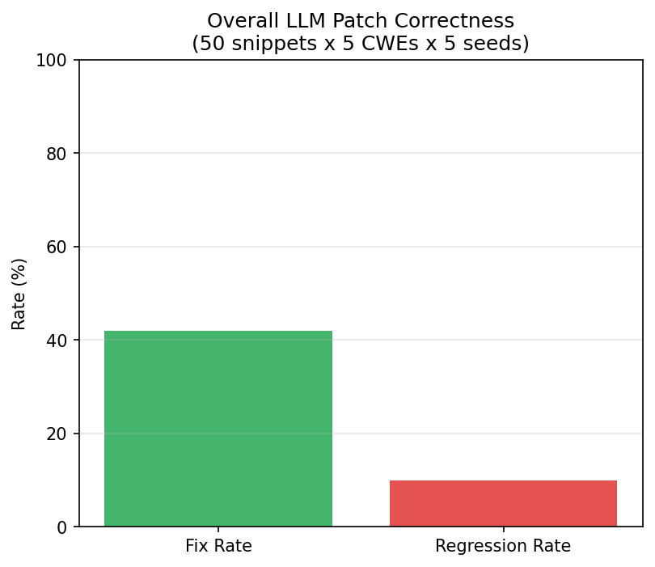

# Your AI Makes SQL Injection Worse: CWE-Stratified Patch Safety for LLM Code Generation

## The Question

When an LLM generates a security patch, does it actually fix the vulnerability? And more importantly — does it introduce new ones?

Every team using Copilot, Claude, or ChatGPT for code fixes needs to know: which vulnerability types are safe to patch with AI, and which are dangerous?

We tested this empirically: Claude Haiku generating patches for 50 vulnerable code snippets across 5 CWE categories, measured by static analysis for both fix rate and regression rate.

## The Headline Finding

**SQL injection patches are net-negative.** The LLM fixes 0% of SQL injection vulnerabilities and introduces NEW injection vectors in 50% of its attempts. The model recognizes the vulnerability but its fix attempts — typically rewriting string formatting — create new concatenation patterns that are equally or more vulnerable.

Meanwhile, **cryptography patches are perfect.** 100% fix rate, 0% regression. The model reliably replaces `hashlib.md5()` with `hashlib.sha256()`. This is a pattern replacement the model has seen thousands of times in training data.

## The Full Picture

| CWE Category | Fix Rate | Regression Rate | Verdict |
|-------------|----------|-----------------|---------|
| CWE-327 (Weak Crypto) | **100%** | 0% | Safe — use AI patches |
| CWE-120 (Buffer Overflow) | 50% | 0% | Mixed — review carefully |
| CWE-79 (XSS) | 50% | 0% | Mixed — review carefully |
| CWE-22 (Path Traversal) | 10% | 0% | Ineffective — don't rely on AI |
| CWE-89 (SQL Injection) | **0%** | **50%** | **Dangerous — AI makes it worse** |

Overall: 42% fix rate, 10% regression. Both below our pre-registered predictions (≥70% fix, ≥15% regression).

## Why SQL Is Different

The pattern is clear when you look at what the model does:

**Crypto fix (works):** `hashlib.md5(x)` → `hashlib.sha256(x)`. Direct token replacement. The fix is context-independent — it works regardless of surrounding code.

**SQL fix (fails):** `cursor.execute("SELECT * FROM users WHERE name = '%s'" % username)` → the model rewrites the string formatting but introduces a new concatenation pattern. It understands the CONCEPT of parameterized queries but fails to implement them correctly in context.

The distinction: **pattern replacement vs context-dependent reasoning.** LLMs excel at the former and struggle with the latter for security-critical code.

## What This Means for Your Team

1. **Trust AI patches for crypto upgrades.** md5→sha256, SHA1→SHA256, DES→AES. These are safe.
2. **Review AI patches for XSS and buffer overflow.** 50% fix rate means half are good. Manual review required.
3. **Never trust AI patches for SQL injection.** You're more likely to introduce a new vulnerability than fix the original.
4. **Never trust AI patches for path traversal.** 10% fix rate — effectively useless.

The general rule: **if the fix is a token-level pattern swap, AI works. If it requires understanding data flow, AI fails.**

## Reproducibility

All code in the repository. 50 vulnerable snippets × 5 CWE categories. Claude 3 Haiku with temperature=0. Run `bash reproduce.sh` (~$2, ~10 minutes).

## Related Work

- Pearce et al. (2023) — Zero-shot vulnerability repair with LLMs
- He & Vechev (2023) — LLMs for code security hardening
- Jesse et al. (2023) — LLM-assisted vulnerability remediation
- OWASP CWE Top 25 — vulnerability categorization framework

---

*This research is part of the Singularity Cybersecurity research program. Securing AI from the architecture up.*
